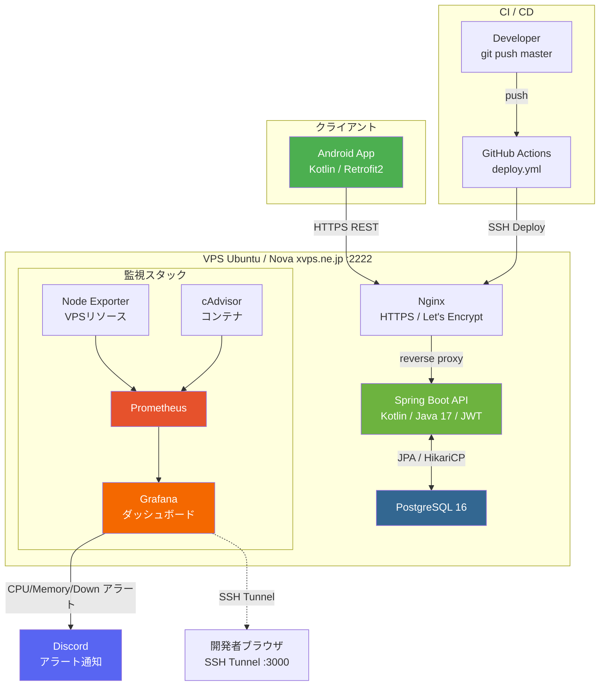

# IdleGame — Kotlin Android × Spring Boot

[](https://github.com/sorapenguin/IdleGameKotlin1/actions/workflows/deploy.yml)


Kotlin製Androidゲームアプリと、サーバーサイドのゲームデータ永続化APIを組み合わせたフルスタック個人プロジェクト。
インフラはVPS上にDocker Compose + Nginx + Prometheus/Grafanaで構築し、GitHub ActionsでCI/CDを自動化している。

**本番API:** https://x162-43-22-7.static.xvps.ne.jp  
**Swagger UI:** https://x162-43-22-7.static.xvps.ne.jp/swagger-ui.html

---

## アーキテクチャ



---

## 技術スタック

| レイヤー | 技術 |
|----------|------|
| **Android** | Kotlin 1.9 / MVVM / StateFlow / Navigation Component / Retrofit2 / Coroutines |
| **API サーバー** | Spring Boot 3.2 / Kotlin / Java 17 / Spring Security / JWT (JJWT 0.12) |
| **データベース** | PostgreSQL 16 / Spring Data JPA / Hibernate 6 |
| **インフラ** | Docker / Docker Compose / Nginx / Let's Encrypt (HTTPS) |
| **CI/CD** | GitHub Actions（masterブランチpushでSSH自動デプロイ） |
| **監視** | Prometheus / Grafana / Node Exporter / cAdvisor |
| **セキュリティ** | UFW / fail2ban / SSH鍵認証 (port 2222) / unattended-upgrades |
| **バックアップ** | pg_dump + gzip / cron 毎日3時 / 7世代ローテーション |
| **API仕様** | springdoc-openapi 2.5 (Swagger UI) |

---

## ディレクトリ構成

```
.
├── IdleGame/                   # Android アプリ (Kotlin)
│   └── app/src/main/kotlin/
│       └── com/example/idlegame/
│           ├── data/           # GameState / GameRepository (SharedPreferences)
│           └── ui/             # Fragment + ViewModel (MVVM)
│
├── IdleGameApi/                # Spring Boot REST API
│   ├── src/main/kotlin/
│   │   └── com/example/idlegameapi/
│   │       ├── config/         # SecurityConfig
│   │       ├── controller/     # REST エンドポイント
│   │       ├── security/       # JWT フィルター / サービス
│   │       └── service/        # ビジネスロジック
│   ├── docker-compose.yml          # ローカル開発用
│   └── docker-compose.prod.yml     # 本番用（nginx + app + postgres）
│
├── infrastructure/
│   ├── backup/
│   │   └── backup-db.sh            # pg_dump + 7世代ローテーション
│   ├── monitoring/
│   │   ├── docker-compose.monitoring.yml   # Prometheus + Grafana + Exporter
│   │   └── grafana/provisioning/alerting/  # Discord アラートルール
│   ├── security/
│   │   ├── ufw-rules.sh
│   │   └── jail.local               # fail2ban 設定
│   ├── RUNBOOK.md                   # 障害対応手順
│   └── RECOVERY_CHECKLIST.md        # VPS再構築手順（チェックリスト付き）
│
└── .github/workflows/
    └── deploy.yml                   # GitHub Actions CI/CD
```

---

## インフラ構成

### セキュリティ

| 対策 | 内容 |
|------|------|
| SSH | port 2222・鍵認証のみ・PermitRootLogin no |
| ファイアウォール | UFW（2222 / 80 / 443 のみ許可） |
| 侵入防止 | fail2ban（SSHブルートフォース → 3600秒 BAN） |
| 自動更新 | unattended-upgrades（セキュリティパッチ） |
| HTTPS | Nginx + Let's Encrypt（HSTS / X-Frame-Options 等セキュリティヘッダ設定済み） |

### 監視・アラート

Grafanaで以下のアラートをDiscordに通知：

| アラート | 閾値 |
|----------|------|
| CPU使用率 | 80% 超が5分継続 |
| メモリ使用率 | 85% 超が5分継続 |
| APIコンテナ停止 | 1分以内に検知 |

### DBバックアップ

- `pg_dump` → gzip 圧縮 → `/home/deploy/backups/` に保存
- cron で毎日 AM3:00 に自動実行
- 7世代（7日分）保持・自動ローテーション

### CI/CD フロー

```
git push master (IdleGameApi/** 変更)
    ↓
GitHub Actions (deploy.yml)
    ↓
SSH (port 2222) → VPS
    ↓
git pull → docker compose up -d --build → docker image prune
```

---

## ローカル起動

### API サーバー

```bash
cd IdleGameApi

# PostgreSQL 起動
docker compose up -d

# Spring Boot 起動
./gradlew bootRun        # Mac / Linux
.\gradlew.bat bootRun    # Windows

# → http://localhost:8080/swagger-ui.html
```

### Android アプリ

Android Studio で `IdleGame/` フォルダを開き、エミュレーターで実行。  
エミュレーター内から PC の localhost には `http://10.0.2.2:8080/` でアクセス可能。

---

## ドキュメント

| ドキュメント | 内容 |
|--------------|------|
| [API仕様 (Swagger UI)](https://x162-43-22-7.static.xvps.ne.jp/swagger-ui.html) | エンドポイント一覧・リクエスト/レスポンス仕様 |
| [IdleGameApi/README.md](IdleGameApi/README.md) | APIサーバー詳細・エンドポイント解説 |
| [infrastructure/RUNBOOK.md](infrastructure/RUNBOOK.md) | 障害対応手順・日常操作コマンド集 |
| [infrastructure/RECOVERY_CHECKLIST.md](infrastructure/RECOVERY_CHECKLIST.md) | VPS再構築手順（チェックリスト） |
